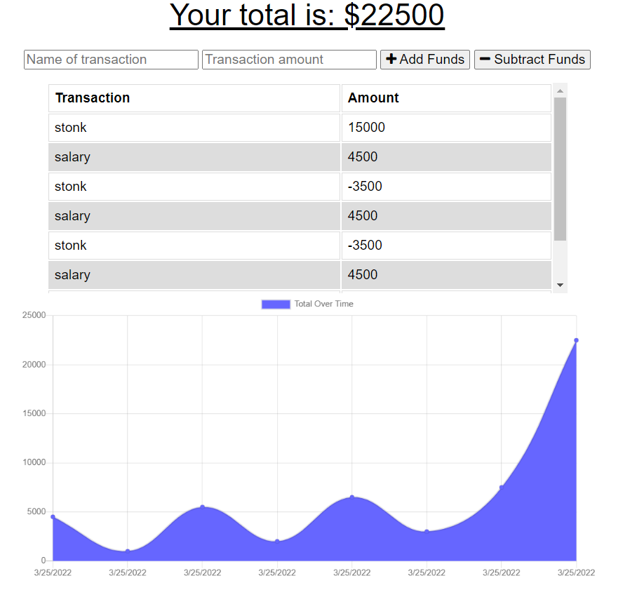

# SAVE-DAT-MONEY

## Description

This project was to build a budget tracker application that would provide users the ability to manually enter expenses and incomes. Offline functionality was added to provide users the ability to continue using the application regardless of internet connectivity.

## Demo

[View Live Site Here](https://hidden-cliffs-27191.herokuapp.com/)

## Built With

   

## Table of Contents

- [Installation](#Installation)
- [Usage](#Usage)
- [License](#License)

## Installation

For local use, users should run the following after download.

`npm install`

## Usage

Users are able to use this application locally by download and installing local packages or via online web-hosted service listed above at 'Live Project Site'

## License

### &copy; 2022 Charlton-H
